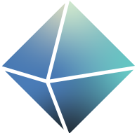
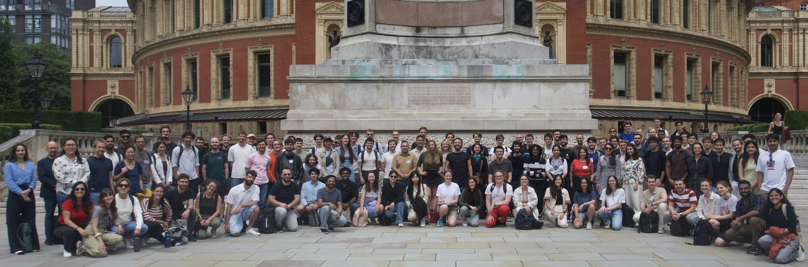

<h1 style="color: #2a446a">LOGML Summer School 2026</h1>

<h2>London, 13-17 July 2026</h2>

  

LOGML (London Geometry and Machine Learning) aims to bring together mathematicians and computer scientists to collaborate on a variety of problems at the intersection of geometry and machine learning. There will be a selection of group projects, each overseen by an experienced mentor, talks by leading figures in the field, and a variety of social events.

Several working groups that started at LOGML went on to form longer-term collaborations leading to publications in notable conferences and journals, including:

::: {style="border: 1px solid #e9ecef; padding: 20px; border-radius: 10px; background-color: #f8f9fa; margin-bottom: 30px;"}

* [Lost in Serialization: Invariance and Generalization of LLM Graph Reasoners (Workshop on Graphs and more Complex structures for Learning and Reasoning, AAAI 2026)](https://arxiv.org/pdf/2511.10234)
* [Rademacher Meets Colors: More Expressivity, but at What Cost? (Workshop on New Perspectives in Advancing Graph Machine Learning, NeurIPS 2025)](https://arxiv.org/pdf/2510.10101)
* [Connecting Neural Models Latent Geometries with Relative Geodesic Representations (Workshop on Symmetry and Geometry in Neural Representations, NeurIPS 2024)](https://openreview.net/pdf?id=gYTblmieFc)
* [Group-invariant machine learning on the Kreuzer-Skarke dataset (Physics Letters B, 2024)](https://doi.org/10.1016/j.physletb.2024.138996)
* [Implicit Convolutional Kernels for Steerable CNNs (NeurIPS, 2023 )](https://arxiv.org/abs/2212.06096)
* [Accelerating Molecular Graph Neural Networks via Knowledge Distillation (NeurIPS, 2023)](https://proceedings.neurips.cc/paper_files/paper/2023/file/51ec452ca04d8ec7160e5bbaf76153f6-Paper-Conference.pdf)
* [Surfing on the Neural Sheaf (Workshop on Symmetry and Geometry in Neural Representations, NeurIPS 2022)](https://openreview.net/pdf?id=xOXFkyRzTlu)
* [Generalized Laplacian Positional Encoding for Graph Representation Learning  (Workshop on Symmetry and Geometry in Neural Representations, NeurIPS 2022)](https://openreview.net/pdf?id=BNhhZwAlVNC)
* [Equivariant Mesh Attention Networks (TMLR, 2022)](https://arxiv.org/pdf/2205.10662.pdf)
* [Unsupervised Network Embedding Beyond Homophily (TMLR, 2022)](https://openreview.net/pdf?id=sRgvmXjrmg)
* [Towards Training GNNs Using Explanation Directed Message Passing (LOG conference, 2022)](https://proceedings.mlr.press/v198/giunchiglia22a.html)
* [Eqivariant Subgraph Aggregation Networks (ICLR 2022, Spotlight)](https://openreview.net/pdf?id=dFbKQaRk15w)
* [A Machine Learning Approach to the Nirenberg Problem (ArXiv Preprint, 2026)](https://arxiv.org/pdf/2602.12368)

:::

You can find a list of previous years' projects and speakers under <a href="logml2025/speaker.qmd">Archives</a> above.

