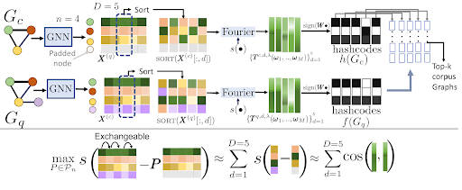

## Abir De

Abir De is Bhide Family Chair Assistant Professor at the Department of Computer Science
and Engineering in IIT Bombay. Before that, he did his postdoctoral research with 
Manuel Gomez Rodriguez in Max Planck Institute for Software Systems at Kaiserslautern, 
Germany. He received his PhD from Department of Computer Science and Engineering, 
IIT Kharagpur. His PhD work was supported by Google India PhD Fellowship 2013. 
Prior to this he did his BTech in Electrical Engineering and MTech in Control Systems 
Engineering both from IIT Kharagpur. His research interests are learning on structured 
objects with focus on graphs and sets.  He is a recipient of Indian National Academy of 
Engineering Young Engineer Award 2021 and Krithi Ramamritham Award for Creative Research 
2020 at IIT Bombay.

## Project

{fig-align="center" width="100%"}

In our recent ICLR paper [[2]](#ref2), we have identified a novel probabilistic symmetry 
in graph neural networks (GNNs), called exchangeability. We demonstrate that node 
embeddings produced by a broad class of GNNs, when trained with standard optimization 
procedures, behave as exchangeable random variables. In practical terms, this means that 
the joint probability density of the node embeddings is invariant under permutations 
along their dimension axis, yielding identically distributed elements within each graph 
representation.  This property has a powerful consequence: transportation-based graph 
similarity measures can be closely approximated by simply computing Euclidean distances 
between the sorted embedding elements across nodes in a fixed-dimensional space. This 
has allowed us to propose a unified locality-sensitive hashing (LSH) framework that 
supports diverse relevance measures for graphs. In the following, we will explore this 
property for large graph matching, where we perform (1) decomposition of graphs in 
multiple substructures; (2) hashing the substructure in buckets based on the above 
Euclidean distance; (3) condensing similar graphs in the same bucket and (4) perform 
multi-layer approximate distance construction.

Given the computational bottlenecks of Graph Edit Distance and Subgraph Matching, we 
first decompose graphs into multiple (possibly overlapping) substructures. These 
substructures are embedded and hashed into buckets using the exchangeability-induced 
sorted representations. We then condense the search space by aggregating highly similar 
substructures within each bucket. Finally, we perform hierarchical neural matching in 
two stages: (i) set-level matching, where sets of substructures within corresponding 
buckets are compared, and  (ii) fine-grained node-level matching restricted to promising 
graph pairs identified in the first stage.

This framework systematically exploits exchangeability to enable efficient, approximate 
graph matching while retaining fidelity to rich structural similarity measures.

### References
[1] Indradyumna Roy, Venkata Sai Velugoti, Soumen Chakrabarti and Abir De. In-
terpretable Neural Subgraph Matching for Graph Retrieval . In AAAI Conference on
Artificial Intelligence (AAAI), 2022.

[2] Kartik Nair, Indradyumna Roy, Soumen Chakrabarti, Anirban Dasgupta, Abir
De. Exchangeability of GNN Representations with Applications to Graph Retrieval .
In International Conference on Learning Representations (ICLR), 2026.

[3] Vaibhav Raj*, Indradyumna Roy*, Ashwin Ramachandran, Soumen Chakrabarti,
Abir De. Charting the Design Space of Neural Graph Representations for Subgraph
Matching . In International Conference on Learning Representations (ICLR), 2025.

[4] Eeshaan Jain*, Indradyumna Roy*, Saswat Meher, Soumen Chakrabarti, Abir
De. Graph Edit Distance with General Costs Using Neural Set Divergence. In Neural
Information Processing Systems (NeurIPS), 2024.

[5] Indradyumna Roy, Rishi Agarwal, Soumen Chakrabarti, Anirban Dasgupta, Abir
De. Locality Sensitive Hashing in Fourier Frequency Domain For Soft Set Contain-
ment Search. In Neural Information Processing Systems (NeurIPS), 2023.

