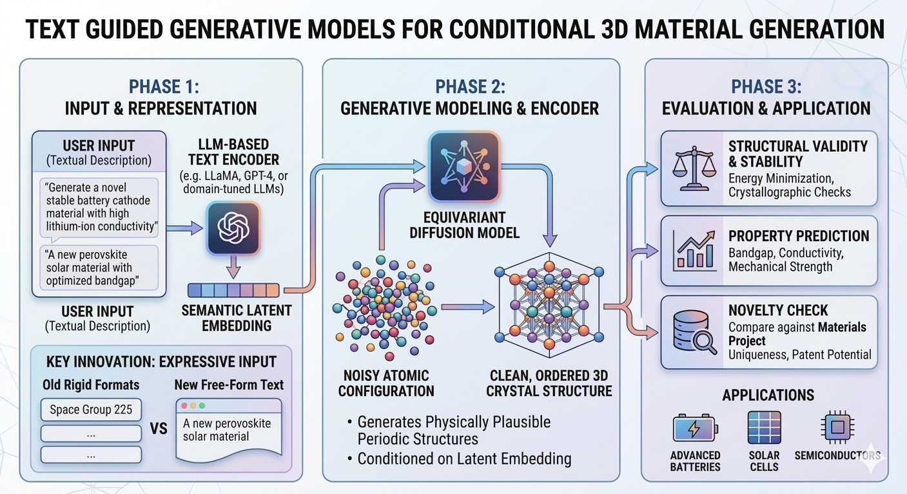

## Kishalay Das

Kishalay Das is currently a Postdoctoral Associate at Yale University, where he works under the supervision of Smita Krishnaswamy. 
He completed his Ph.D. as a Prime Minister’s Research Fellow (PMRF) at the Indian Institute of Technology,
Kharagpur (2020–2026), as part of the Complex Networks Research Group
(CNeRG), where he was advised by Prof. Niloy Ganguly and Prof. Pawan Goyal.
He received his M.Tech (2020) from the Department of Computer Science and
Automation (CSA), Indian Institute of Science (IISc), Bangalore, under the
guidance of Prof. M. N. Murty. His research lies at the intersection of Graph
Representation Learning, Geometric Deep Learning, and Generative Modeling,
with a strong focus on AI for Science and AI for Medicine.

## Project

{fig-align="center" width="100%"}

Designing novel 3D crystal structures with desired atomic compositions and
properties remains a fundamental challenge in materials science. Such materials
are critical for advancing technologies in batteries, solar cells, semiconductors,
and beyond. In this project, we aim to develop generative models capable of
producing realistic and stable 3D crystal materials.

Recent progress in equivariant diffusion models has demonstrated strong
potential for generating physically plausible periodic structures. However, most
existing approaches are unconditional, limiting users’ ability to specify target
material properties—an essential requirement in practical material design.

Although conditional material generation has seen some progress, it remains an
open problem. With the rapid advancement of large language models (LLMs),
recent works [[1](#ref1)-[5](#ref5)] have begun integrating LLMs with generative frameworks
such as diffusion and flow models to enable text-guided material generation.
These methods allow users to describe desired properties—such as atomic
composition, space group, crystal system, and volume—through textual prompts.

However, current approaches typically rely on rigid and predefined text formats
(both long and short descriptions), which restrict the flexibility and richness of
user input. This limitation raises an important question: Can more expressive
LLMs better capture free-form user intent and improve alignment between textual
descriptions and generated materials?

Our project aims to:
* Reproduction and Extension of Existing Work:
  * Implement and validate state-of-the-art text-guided diffusion models for 3D crystal generation (e.g., frameworks from recent literature).
  * Reproduce published results to benchmark baseline performance.

* Integration of Advanced Language Models:
  * Replace existing text encoders (MatSciBERT/CLIP) with modern LLMs (e.g., GPT-4, LLaMA, or domain-tuned variants) to process free-form textual descriptions of target materials.

* Comprehensive Evaluation:
  * Quality Assessment: Quantify how well generated materials match user-specified criteria (e.g., composition, symmetry, properties).
  * Stability and Validity: Evaluate structural stability via energy minimization and crystallographic validity checks.
  * Novelty: Compare generated materials against existing databases (e.g., Materials Project) to ensure uniqueness.

By exploring different LLMs as text encoders, we hope to improve the flexibility
and expressive power of the textual input, making the model more useful in
real-world material design scenarios. Our effort will hopefully improve the
generation of 3D materials, which could significantly transform material design
and drive the creation of new technologies.

### References
[1] Das, K., Khastagir, S., Goyal, P., Lee, S.-C., Bhattacharjee, S., & Ganguly, N. Periodic Materials Generation using Text-Guided Joint Diffusion Model. ICLR 2025.

[2] Park, H., Onwuli, A., & Walsh, A. Exploration of crystal chemical space using text-guided generative artificial intelligence. (2024).

[3] Khastagir, S., Das, K., Goyal, P., Lee, S.-C., Bhattacharjee, S., & Ganguly, N. LLM Meets Diffusion: A Hybrid Framework for Crystal Material Generation. NeurIPS 2025.

[4] Gruver, N., et al. Fine-tuned language models generate stable inorganic materials as text. arXiv:2402.04379 (2024).

[5] Sriram, A., Miller, B. K., Chen, R. T., & Wood, B. M. FlowLLM: Flow Matching for Material Generation with Large Language Models as Base Distributions. NeurIPS 2024.