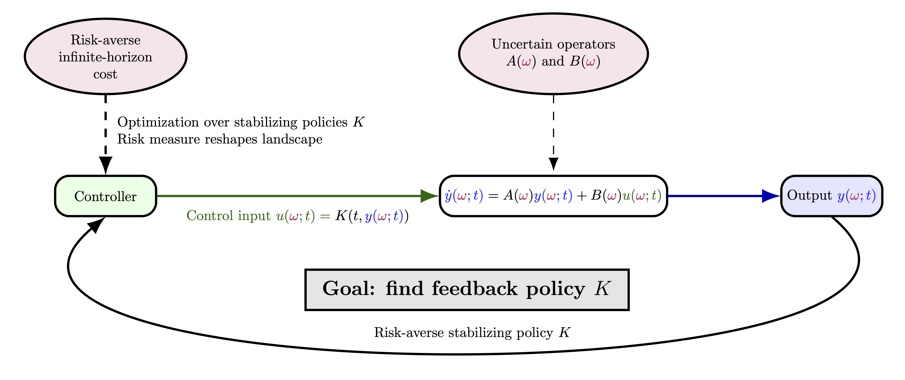

## Philipp Guth

Philipp Guth is a postdoctoral researcher at the Johann Radon Institute for Computational and Applied Mathematics of the Austrian Academy of Sciences and teaches at the Johannes Kepler University in Linz. 
He completed his PhD in Mathematics at the University of Mannheim. 
During his PhD, he developed efficient numerical methods for optimisation problems constrained by partial differential equations under uncertainty. 
His current research focuses on uncertainty quantification for such problems in the presence of parametric uncertainty, with particular interest in risk-averse formulations and data-driven approaches to robust feedback strategies in high-dimensional settings.

## Project

{fig-align="center" width="100%"}

In many problems in science and engineering, the governing equations of a system are well understood, yet key parameters remain uncertain due to measurement errors, material heterogeneity, or unobserved external influences.
Parametric dynamical systems provide a natural way to capture this uncertainty by embedding it directly into the system operators, combining known physical structure with variability across different realizations.

In this project, we study policy learning for linear dynamical systems under parametric uncertainty. 
The objective is based on the entropic risk measure, producing a risk-averse problem over a parametric family of operators rather than a single stochastic system. 
While prior work in risk-averse reinforcement learning focuses on trajectory noise, we instead model uncertainty at the level of system operators.

For infinite-horizon costs, stability is not imposed explicitly but arises as a domain constraint: the objective is finite only for stabilizing policies, so optimization effectively occurs over the manifold of stabilizing operators. 
Within this domain, entropic risk measure reshapes the cost landscape by exponentially emphasizing high-cost parameter realizations, interpolating between average and worst-case performance. 
The project will explore and analyze robust, risk-averse linear feedback policies across uncertain system operators, particularly in the challenging setting of an infinite time horizon.
