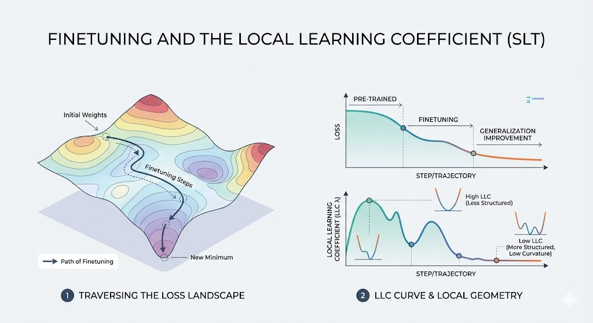

## Sergio Estan Ruiz

Sergio is a PhD student at Imperial College London under Prof. Guy Nason, where he looks at interpretability and machine learning for public policy. 
Previously, he completed Part III at Cambridge where he transitioned from pure mathematics to machine learning via a thesis on topological data analysis. 
Currently, his research interests range from network time series modelling, to interpretability of LLMs and singular learning theory. 

## Project

{fig-align="center" width="100%"}

Singular Learning Theory (SLT) is a Bayesian theory of learning which tries to understand statistical properties of parametric
models via the geometry of an associated loss landscape. In SLT, the Local Learning Coefficient (LLC) is a measure of the 
local degeneracy of the loss surface and it's related to quantities of interest like the expected generalisation error of the model. 
Recently, LLC has been employed as an interpretability tool to characterise phenomena like grokking [[1]](#ref1) or to understand phase transitions 
and circuit formation during the training of small language models [[2]](#ref2). Moreover, other SLT-inspired quantities such as susceptibilities 
have been used for structural inference in small language models to identify internal structure [[3]](#ref3).

The aim of this project is to utilise tools from SLT for interpretability in LLM safety research. I except to cover some of the SLT theory
first and then collectively decide on the specific application we want to look at. As an example, we could analyse jailbreak 
susceptibilities in language models. We could finetune base models with different safety techniques and evaluate the evolution 
of the LLC as the model moves through the loss landscape. Are the LLC trajectories related to the model's susceptibilities to jailbreaks? 
We could also use the structural inference techniques in Baker et al. [[3]](#ref3) to investigate whether behaviours such as refusal signals are 
associated with specific high-susceptibility directions, and whether safety interventions systematically reorganise these directions within 
the model’s internal structure.

### References

[1] Ben Cullen et al, Grokking as a Phase Transition between Competing Basins: a Singular Learning Theory Approach. ArXiv preprint, URL: <a href="https://arxiv.org/abs/2603.01192">https://arxiv.org/abs/2603.01192</a>

[2] Jesse Hoogland et al, Loss Landscape Degeneracy and Stagewise Development in Transformers. ArXiv preprint, URL: <a href="https://arxiv.org/abs/2402.02364 ">https://arxiv.org/abs/2402.02364</a>

[3] Garrett Baker et al, Structural Inference: Interpreting Small Language Models with Susceptibilities, URL: <a href="https://arxiv.org/pdf/2504.18274">https://arxiv.org/pdf/2504.18274</a>