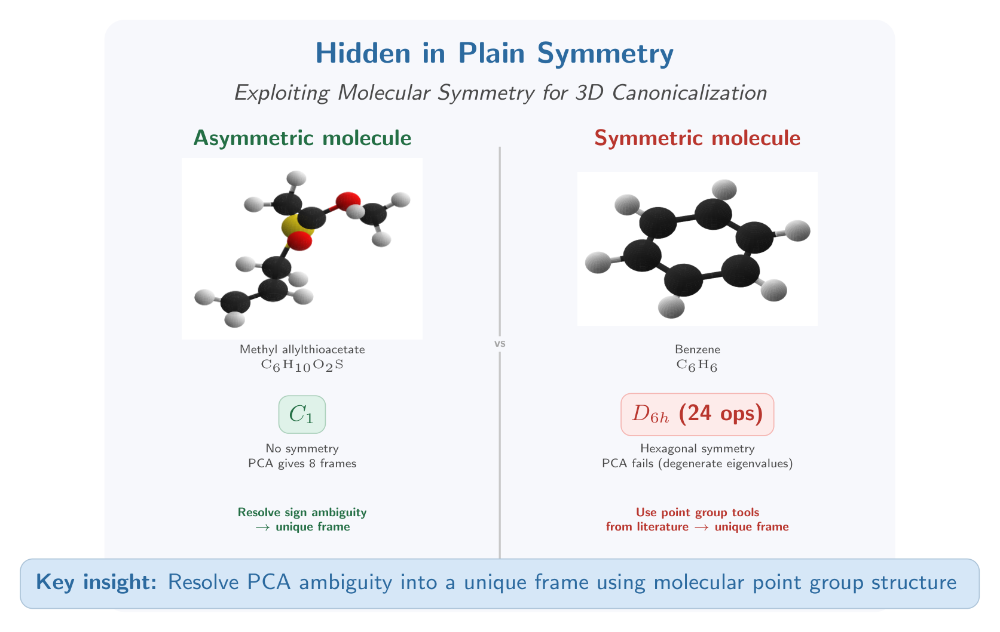

## Snir Hordan

Snir Hordan is a PhD candidate in Applied Mathematics at the Technion – Israel Institute of Technology, advised by Asst. Prof. Nadav Dym. 
His research focuses on the expressive power of geometric machine learning models on point clouds and graphs. His first author publications include a NeurIPS 2025 Spotlight proving that spectral graph neural networks are incomplete even on graphs with a simple spectrum, an ICML 2024 paper constructing the first universal equivariant 3D point cloud network with polynomial complexity, and an AAAI 2024 paper on complete invariant networks for Euclidean graphs (with Harvard). 
He co designed and taught the course "Deep Learning and Groups" with Asst. Prof. Haggai Maron, covering representation theory of finite and compact groups, equivariant neural networks, and Weisfeiler Leman methods.

## Project

{fig-align="center" width="100%"}

Canonicalization, mapping a 3D point cloud to a unique representative of its rotation orbit, 
lets standard (non equivariant) architectures distinguish among rotated copies of the same molecule, 
improving generalization and giving an efficiency advantage over both rotation augmentation 
(which multiplies training cost) and equivariant architectures (which add per layer overhead) 
[[5](#ref5), [8](#ref8), [9](#ref9)]. The dominant canonicalization method is PCA: diagonalize 
the inertia tensor to obtain a coordinate frame. But PCA has a well-known flaw, sign ambiguity 
creates 8 equivalent orientations (a (Z/2)^3 orbit), and it fails entirely on symmetric point 
clouds whose inertia tensors have degenerate eigenvalues [[1]](#ref1). 
This matters for molecular ML because symmetric point clouds are prevalent in organic molecules: 
our preliminary analysis shows 16.4% of QM9 have non trivial point group symmetry, and PCA produces 
completely inconsistent frames on these molecules (inconsistency of 1.0 on cubes, 0.95 on tetrahedra).

We fix this by canonicalizing symmetric point clouds using tools from computational geometry. 
Every molecule has a point group H, a finite subgroup of O(3), computable from atomic coordinates by standard chemistry tools (e.g., a one-line RDKit call). 
Crucially, while continuous canonicalization over SO(3) is provably impossible [[1]](#ref1), this impossibility does not apply to finite subgroups: canonicalization over a finite H is a discrete combinatorial problem that is always tractable. 
We reframe PCA's sign ambiguity as a group orbit problem: for asymmetric molecules (H = C1), resolve the (Z/2)^3 orbit to a unique frame; for symmetric molecules (e.g., benzene with H = D6h and 24 operations), construct H orbit canonical forms using optimal symmetry detection algorithms from the computational geometry literature, specifically, Wolter, Woo, and Volz's O(n log n) algorithm for 3D point set symmetry detection [[11]](#ref11), Atallah's symmetry detection framework [[12]](#ref12), and Highnam's optimal planar algorithms [[13]](#ref13). 
These classical algorithms compute the symmetry group of a point set and produce canonical representatives of finite group orbits in polynomial time. 
The resulting canonical frames are provably correct and exploit symmetry information that is already available for every molecule but has never been incorporated into ML pipelines.

We will benchmark on two complementary datasets. QM9 (~134k molecules, up to 9 heavy atoms, elements H/C/N/O/F) is the standard molecular property prediction benchmark; our preliminary analysis shows 16.4% of QM9 (21,400 molecules) have non trivial symmetry, and PCA fails completely on symmetric objects (inconsistency of 1.0 on cubes, 0.95 on tetrahedra). 
QM sym (135k molecules with guaranteed non trivial symmetry, elements H/B/C/N/O/F/Cl/Br) provides a controlled testbed where every molecule has a known point group: 60.9% are C2h, 30.0% are C3h, and 9.7% are C4h. 
QM sym also provides orbital degeneracy data (HOMO 5 through LUMO+5) and orbital symmetry labels, direct signatures of the symmetry that PCA cannot handle. 
Together, these datasets let us stratify results by molecular symmetry type: from fully asymmetric molecules where PCA works (modulo sign) to highly symmetric molecules where it fails entirely.

Beyond the theoretical contribution, students gain hands on empirical research experience with modern Transformer architectures: we plug the constructed canonical frames into molecular Transformers and design new attention mechanisms that condition on the canonicalized coordinates, connecting the group theoretic framework directly to state of the art architectures used in practice.

We run the first controlled comparison of four paradigms, PCA canonicalization, H orbit canonicalization, rotation augmentation, and equivariant architectures, with matched parameters, stratified by molecular symmetry type. 
This project can be broken down into 3 main components:

1. Mathematical foundations and molecular symmetry census. O(3) finite subgroups, PCA as a (Z/2)^3 orbit problem, and H orbit canonical frame construction. Compute molecular point groups for QM9 (using RDKit) and leverage the ground truth symmetry labels in QM sym; produce a joint census by symmetry class across both datasets.

2. Implementation and matched parameter comparison. Implement frame averaged PointNet with PCA frames, H orbit frames, and SO(3) augmentation; compare against equivariant baselines. Train on QM9 energy prediction and QM sym property prediction with matched architectures and parameter counts.

3. Stratified analysis and workshop paper. Stratify all results by molecular symmetry type (C1 vs. Cs vs. C2v vs. Cnh, etc.); eigenvalue gap analysis linking Laplacian spectral degeneracy to 3D symmetry; prepare a workshop paper draft (LoG 2026 or NeurIPS workshop).

### References

[1] Dym, Lawrence, and Siegel, "Equivariant Frames and the Impossibility of Continuous Canonicalization," ICML 2024.

[2] Liang et al., "QM sym, a symmetrized quantum chemistry database of 135 kilo molecules," Scientific Data 6, 213 (2019).

[3] Liang et al., "QM symex, update of the QM sym database with excited state information for 173 kilo molecules," Scientific Data 7, 400 (2020).

[4] Ramakrishnan et al., "Quantum chemistry structures and properties of 134 kilo molecules," Scientific Data 1, 140022 (2014).

[5] Puny et al., "Frame Averaging for Invariant and Equivariant Network Design," ICLR 2022.

[6] Hordan et al., "Complete Neural Networks for Complete Euclidean Graphs," AAAI 2024.

[7] Hordan et al., "Spectral Graph Neural Networks are Incomplete on Graphs with a Simple Spectrum," NeurIPS 2025 (Spotlight).

[8] Lin et al., "Equivariance via Minimal Frame Averaging for More Symmetries and Efficiency," ICML 2024.

[9] Ma et al., "A Canonicalization Perspective on Invariant and Equivariant Learning," NeurIPS 2024.

[10] Hordan et al., "Weisfeiler Leman for Euclidean Equivariant Machine Learning," ICML 2024.

[11] Wolter, Woo, and Volz, "Optimal algorithms for symmetry detection in two and three dimensions," The Visual Computer 1(1), 37–48 (1985).

[12] Atallah, "On symmetry detection," IEEE Transactions on Computers C 34(7), 663–666 (1985).

[13] Highnam, "Optimal algorithms for finding the symmetries of a planar point set," Information Processing Letters 22(5), 219–222 (1986).

