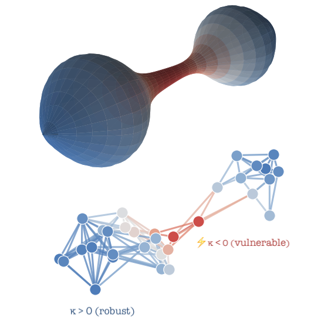

## Sofiane Ennadir

Sofiane is a Researcher at Microsoft Gaming and King studio, where he focuses on representation learning across multiple modalities, including time series and graph-structured data. 
He earned his PhD from KTH Royal Institute of Technology under the supervision of Professor Michalis Vazirgiannis, where his research centered on the adversarial robustness of Graph Neural Networks (GNNs). 
During his doctoral studies, he interned at the Flatiron Institute (Simons Foundation) in New York, where he worked on extending Joint-Embedding Predictive Architectures (JEPA) for time series. 
He also holds an MSc in Data Science from École Polytechnique in Paris.

## Oleg Smirnov

Oleg is a Sr. Principal Researcher at Microsoft Gaming and King studio, where he focuses on behavior modeling and the alignment of AI agents with human players. 
His broader research interests include geometric methods, particularly deep learning in non-Euclidean domains and Riemannian optimization, as well as uncertainty quantification, and Bayesian learning. 
Before joining Microsoft, he held research positions at Amazon and Spotify. Oleg's background is in Applied Mathematics from Kyiv Polytechnic Institute.

## Project

{fig-align="center" width="100%"}

Message passing in GNNs is shaped by the local topology of the input graph. 
However, existing robustness analyses rely largely on Lipschitz continuity that measure graph differences through adjacency matrix norms [[1]](#ref1), while overlooking structural properties (which were used previously to understand some behaviors such as over-squashing and bottlenecks [[2]](#ref2)). 

Discrete curvature offers a natural extension: positively curved regions provide redundancy in message passing, while negatively curved bottlenecks funnel information through narrow passages. 
We theorize that this geometric contrast translates into robustness to adversarial perturbation.

This project will test that hypothesis by computing discrete curvature notions and correlating them with attack success rates using existing adversarial toolkits. 
If the link holds, it opens two natural directions: curvature-guided attacks that exploit bottleneck structure, and curvature-aware rewiring as a model-agnostic defense. 
The goal is to establish a geometry-informed foundation for understanding and improving adversarial robustness on graphs.

### References

[1] “Bounding the Expected Robustness of Graph Neural Networks Subject to Node Feature Attacks.” - Ennadir et al., 2024 (ICLR) 

[2] “Understanding over-squashing and bottlenecks on graphs via curvature.” - Topping et al., 2022 (ICLR)
