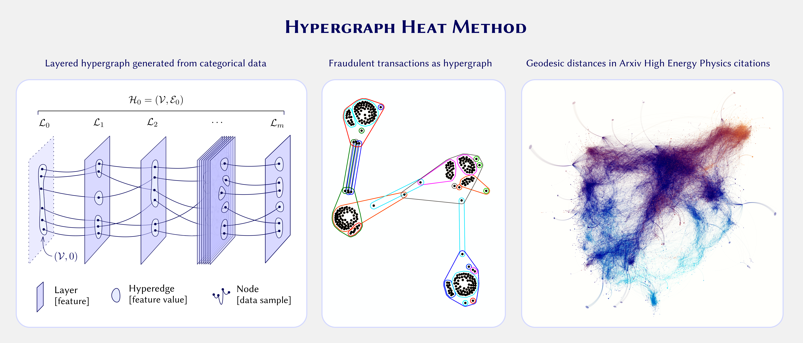

## Jiří Minarčík

Jiří Minarčík is a mathematician working at the intersection of geometry, computation, and machine learning. 
He is currently a Fulbright-Masaryk Scholar at Carnegie Mellon University, working with Keenan Crane on 
geometric flows and their applications in computer graphics and computational geometry. He completed his 
Ph.D. in Mathematics at the Czech Technical University in Prague in 2024. His research focuses on the 
geometry of evolving curves and surfaces, and their connections to computation and data. Alongside academia,
 he spent six years at Resistant AI, helping build machine learning systems for fraud detection based on 
 graph and hypergraph representations.

## Project

{fig-align="center" width="100%"}

The classical heat method computes distances on smooth surfaces by simulating diffusion and solving a 
linear system [[1]](#ref1). This project asks how the same concept can be extended to hypergraphs. These naturally
arise in settings where interactions are not pairwise, such as categorical data, co-authorship, or fraud 
detection. Unlike graphs, hypergraphs connect multiple vertices at once and lack a canonical notion of 
direction, so even basic geometric operators are not uniquely defined. We will define gradient, divergence,
and Laplacian operators on hypergraphs, drawing on existing constructions such as [[2]](#ref2), and use them to 
build a diffusion-based distance method following the same structure as in the classical case: diffusion,
normalization, and a Poisson solve. We will implement the method using sparse linear algebra and test it 
on real datasets, where the resulting distances reveal large-scale structure in the data and provide a 
geometric view of higher-order networks.

### References
[1] Keenan Crane, Clarisse Weischedel, and Max Wardetzky. The Heat Method for Distance Computation. Communications of the ACM, 2017.

[2] Shota Saito, Danilo P. Mandic, and Hideyuki Suzuki. Hypergraph p-Laplacian: A Differential Geometry View. AAAI, 2018.
