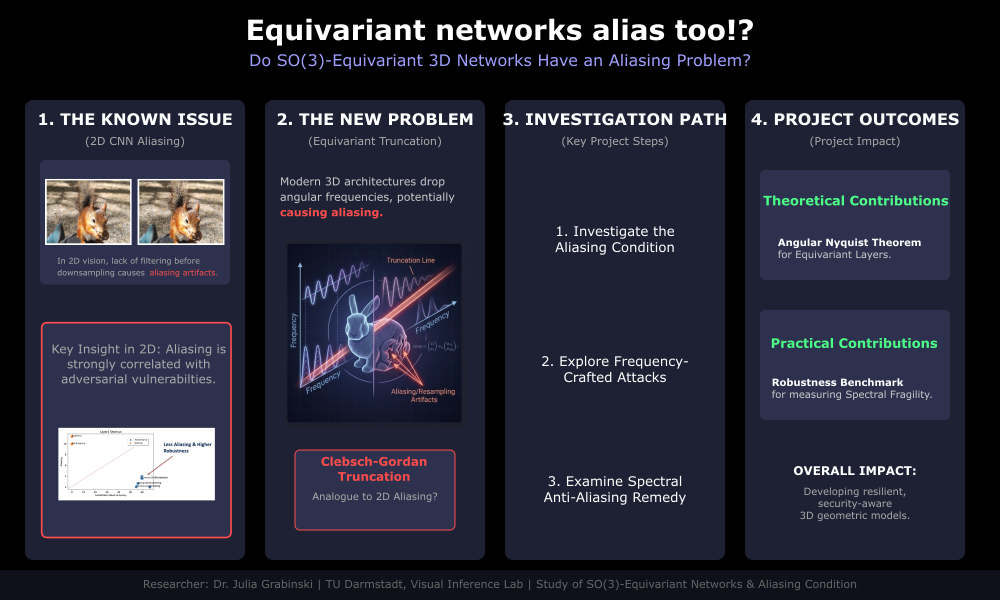

## Julia Grabinski

Julia Grabinski is a Postdoctoral Fellow at the Visual Inference Lab at TU Darmstadt, led by Prof. Stefan Roth. 
Her research interests lie in the broad field of computer vision, with a specific focus on signal processing, 
Fourier analysis, and 3D scene reconstruction and understanding. As part ofs her PhD at the University of Mannheim, 
she demonstrated how aliasing, the corruption of signals during resampling, creates adversarial vulnerabilities in neural networks.

## Project

{fig-align="center" width="100%"}

Standard CNNs are prone to aliasing, without a low-pass filter before downsampling, high-frequency components fold back into the signal
and corrupt it. Recent work has shown this produces significant adversarial vulnerabilities in 2D vision, compromising their reliability
and robustness [[4]](#ref4). This lens has never been applied to equivariant 3D networks, despite the fact that every layer performs an analogous
operation, i.e. silently dropping angular frequency components above a chosen degree. While spectral pooling was shown to partially address
this in spherical CNNs [[3]](#ref3), the dominant modern architectures such as NequIP [[1]](#ref1) or MACE [[2]](#ref2), rely on Clebsch-Gordan tensor product
truncation, where angular frequencies above $l_{max}$ are discarded at every message passing step, and this has never been examined
through a signal-processing lens. This project aims to close that gap.  We plan to investigate the aliasing condition for SO(3)-equivariant networks, 
explore whether frequency-crafted geometric attacks can expose the resulting vulnerabilities, and examine whether a spectral anti-aliasing 
remedy can counter them.

This project could yield both a theoretical contribution, an angular Nyquist theorem for equivariant layers, and a practical one: 
a benchmark measuring spectral fragility in geometric deep learning.

### References
[1] Batzner, Simon, et al. "E (3)-equivariant graph neural networks for data-efficient and accurate interatomic potentials." Nature communications 13.1 (2022): 2453.

[2] Batatia, Ilyes, et al. "MACE: Higher order equivariant message passing neural networks for fast and accurate force fields."  NeurIPS (2022): 11423-11436.

[3] Esteves, Carlos, et al. "Learning so (3) equivariant representations with spherical cnns." Proceedings of the european conference on computer vision (ECCV). 2018.

[4] Grabinski, Julia, et al. "Aliasing and adversarial robust generalization of cnns." Machine Learning 111.11 (2022): 3925-3951.