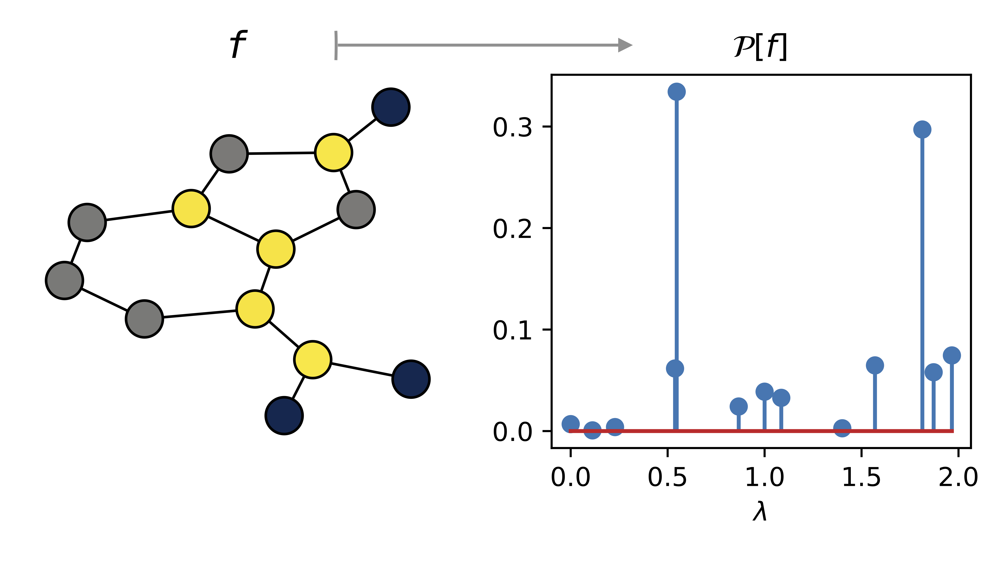

## Ka Man (Ambrose) Yim

Ka Man (Ambrose) is a postdoctoral research associate at the Statistics Department of the University of Oxford. 
He is a member of the Erlangen AI Hub on the Mathematical Foundations of AI. 
His research is focussed on topological data analysis, spanning applications of topology to dynamical systems, geometric deep learning, topological transforms of shapes, and statistical inference of geometric and topological invariants. 

## Project

{fig-align="center" width="100%"}

The readout layer is an essential component in graph neural networks (GNNs) for graph representation learning. 
In this project, we will develop a novel readout layer aiming to increase the expressivity of a GNN using graph Laplacians. 

The readout produces a graph embedding by aggregating the set of vertex features learnt by equivariant layers of a GNN. 
As readouts ought to be permutation invariant, readout layers in practice are simple operations, such as the sum over the set of vertex features. 
However, the choice of readouts can impact the expressivity of GNNs [[1](#ref1), [2](#ref2)].

In this project, we will use the projection-valued measure of the graph Laplacian as the foundation of a novel readout architecture. 
The projection-valued measure transforms the set of vertex features into real-valued measures that are stable and permutation invariant [[3]](#ref3). 
During the week, we will explore the gains in expressivity in using this readout architecture both empirically and theoretically, and whether it can help mitigate issues such as oversmoothing of vertex features in training. 

### References

[1] Xu, K., Hu, W., Leskovec, J., & Jegelka, S. (2018). How powerful are graph neural networks?. arXiv preprint arXiv:1810.00826.

[2] Talhi, M., Wolf, A., & Monod, A. (2026). Breaking Symmetry Bottlenecks in GNN Readouts. arXiv preprint arXiv:2602.05950.

[3] Djima, K. Y., & Yim, K. M. (2025). Power Spectrum Signatures of Graphs. arXiv preprint arXiv:2503.09660.