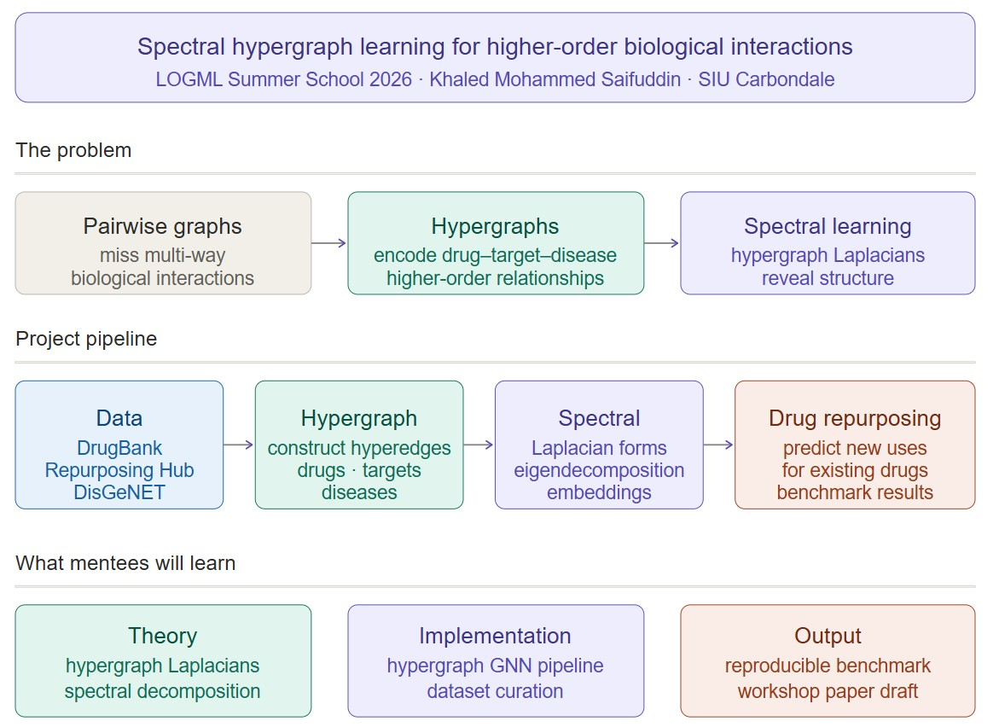

## Khaled Mohammed Saifuddin

Khaled Mohammed Saifuddin is a Tenure-track Assistant Professor of Computer Science at Southern Illinois University Carbondale. 
He received his PhD from Georgia State University and completed a postdoctoral fellowship at the Barabasi Lab (CCNR, Northeastern University. 
His research spans graph machine learning, graph generative AI, graph mining, and network science, with applications in bioinformatics, network medicine, and health data analytics. 
He also works on vision-language reasoning, event understanding, and social network analysis. 
He has published at venues including ICDE, KDD, CIKM, and ECML PKDD, and received the Outstanding Poster Presentation Award at the Machine Learning in
Drug Discovery Symposium at the Broad Institute of MIT and Harvard, First Place Dell Intel
Student Award for Outstanding Use of Data Science and Computing, and others.

## Project

{fig-align="center" width="100%"}

Biological systems are inherently higher-order, proteins form complexes, drugs interact in combinations, and diseases co-occur in networks that cannot be fully captured by pairwise graphs. 
Hypergraphs provide a natural mathematical framework for modeling these interactions, where hyperedges encode relationships among three or more entities simultaneously.

This project investigates spectral properties of hypergraphs, specifically hypergraph Laplacians and their decomposition — to learn representations of higher-order biological interactions for drug repurposing. 
We aim to identify new therapeutic uses for existing drugs by modeling complex higher-order relationships between drugs, targets, and diseases.

Mentees will study hypergraph Laplacians and spectral theory, work with real biomedical datasets (DrugBank, Repurposing Hub, DisGeNET, Human Disease Network), and implement a spectral hypergraph neural network pipeline. 
The goal is a concrete, reproducible result — a working model benchmark or preliminary findings suitable for a conference paper.