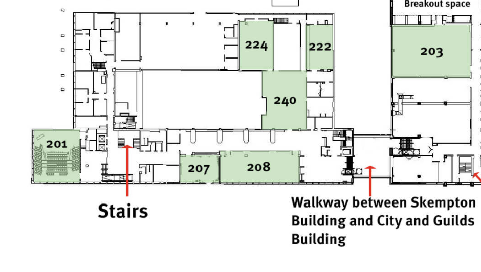
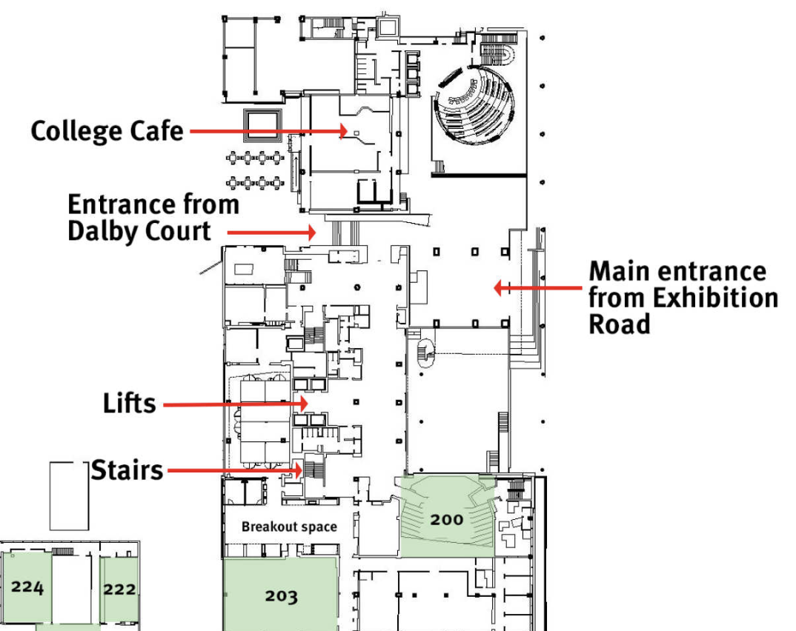
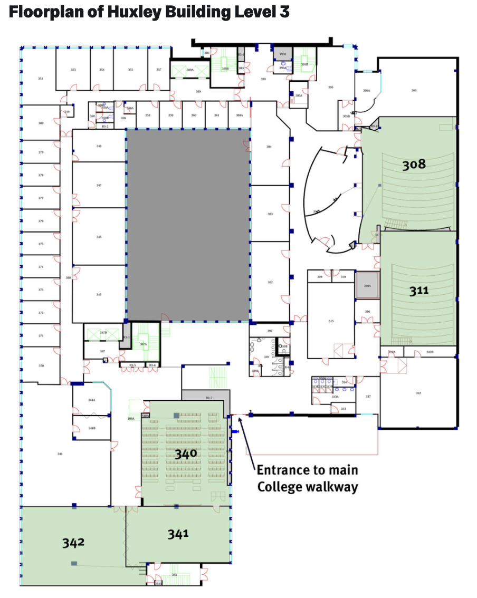
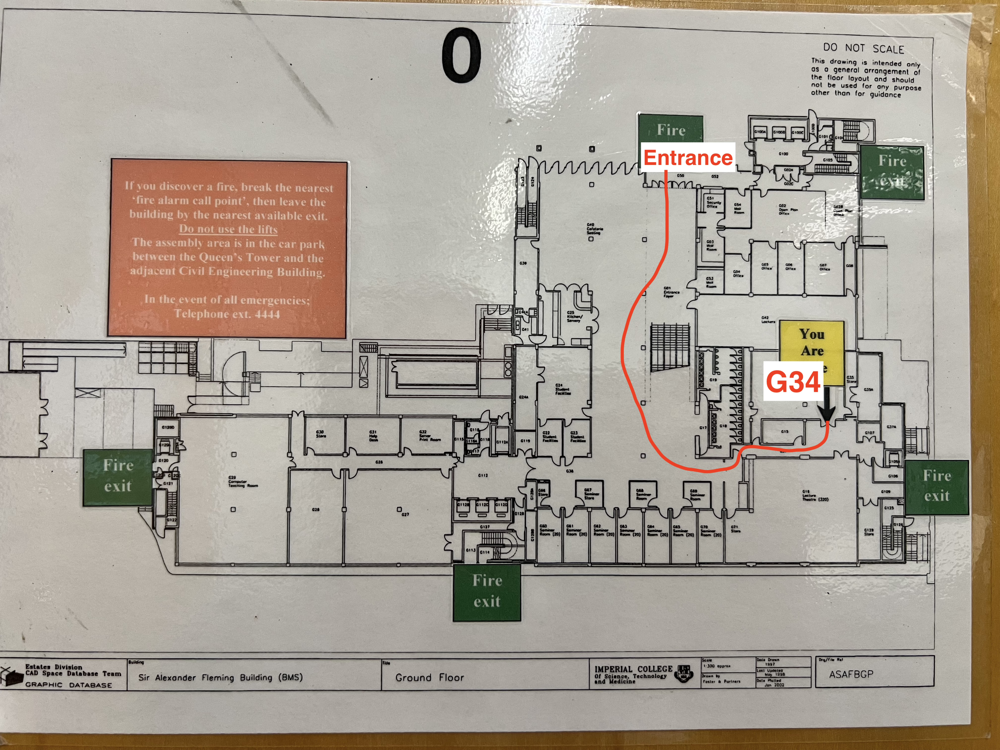

## Schedule

All lectures will be held at Skempton Lecture Hall (LT 164)

<table class="schedule-table">
    <tr>
        <th class="header">Time</th>
        <th class="header">Monday 13 July</th>
        <th class="header">Tuesday 14 July</th>
        <th class="header">Wednesday 15 July</th>
        <th class="header">Thursday 16 July</th>
        <th class="header">Friday 17 July</th>
    </tr>

    <tr>
        <td class="time h80" rowspan="2">8:00 - 9:00</td>
        <td class="salmon" rowspan="3">Registration + Welcome Breakfast Royal College of Music</td>
        <td rowspan="2"></td><td rowspan="2"></td><td rowspan="2"></td><td rowspan="2"></td>
    </tr>
    <tr></tr>
    <tr>
        <td class="time h40">9:00 - 9:30</td>
        <td class="grey">Tea and coffee</td>
        <td class="grey">Tea and coffee</td>
        <td class="grey">Tea and coffee</td>
        <td class="grey">Tea and coffee</td>
    </tr>

    <tr>
        <td class="time h80">9:30 - 10:30</td>
        <td class="blue">Tutorial: Pascal Welke <em>A Tale of Graph Representation Learning</em></td>
        <td class="blue">Talk: Xiaowen Dong <em>Learning Graphs from Data</em></td>
        <td class="blue">Tutorial: Giovanni Marchetti <em>Algebraic Geometry of Deep Learning</em></td>
        <td class="blue">Talk: Stephanie Jegelka <em>Neural parameter symmetries: Learning on LoRAs, breaking parameter symmetries and the effect of data</em></td>
        <td class="blue">Talk: Olga Fink <em>Momentum-Conserving Physics-Informed Graph Neural Networks for Dynamical Systems</em></td>
    </tr>

    <tr>
        <td class="time h40">10:30 - 11:00</td>
        <td class="grey">Tea and coffee</td>
        <td class="grey">Tea and coffee</td>
        <td class="grey">Tea and coffee</td>
        <td class="grey">Tea and coffee</td>
        <td class="peach" rowspan="3">Project presentations</td>
    </tr>

    <tr>
        <td class="time h80">11:00 - 12:00</td>
        <td class="blue">Tutorial: Soledad Villar <em>Equivariant machine learning on any-size inputs and connections to hyperparameter transfer</em></td>
        <td class="blue">Talk: Dorina Thanou <em>Learning Graphs from Data</em></td>
        <td class="blue">Talk: Nicholas Sharp <em>Discrete Structures in 3D Geometric Learning</em></td>
        <td class="blue">Talk: Ismail Ilkan Ceylan <em>Graph Foundation Models: What Transfers Across Graphs, Relations, and Tasks</em></td>
    </tr>

    <tr>
        <td class="time h80">12:00 - 13:00</td>
        <td class="grey">Lunch break</td>
        <td class="grey">Lunch break</td>
        <td class="grey">Group photo + Lunch break</td>
        <td class="grey">Lunch break</td>
    </tr>

    <tr>
        <td class="time h320">13:00 - 17:00</td>
        <td class="peach">Project time</td>
        <td class="peach">Project time</td>
        <td class="grey">Afternoon off (project rooms still available for project time if desired)</td>
        <td class="peach">Project time</td>
        <td class="green">Picnic in Hyde Park</td>
    </tr>

    <tr>
        <td class="time h80" rowspan="2">17:00 - 18:00</td>
        <td class="pink" rowspan="3">Poster session Snacks / Drinks</td>
        <td rowspan="2"></td>
        <td class="green" rowspan="4">Social Event: Company night at Scale Space London</td>
        <td rowspan="2"></td>
        <td rowspan="2"></td>
    </tr>
    <tr></tr>
    <tr>
        <td class="time h40">18:00 - 18:30</td>
        <td></td>
        <td class="green" rowspan="2">Social Event: Blues night at the Blues Kitchen Shoreditch</td>
        <td></td>
    </tr>
    <tr>
        <td class="time h80">From 18:30</td>
        <td></td>
        <td class="green">Social Event: Bouldering White City</td>
        <td></td>
    </tr>
</table>

## Directions

##### South Kensington Campus Map

##### Skempton Building, Level 2 Map

##### City and Guilds Building (CAGB), Level 2 Map

##### Huxley Building, Level 3 Map

##### Sir Alexander Fleming (SAF) Building Map

