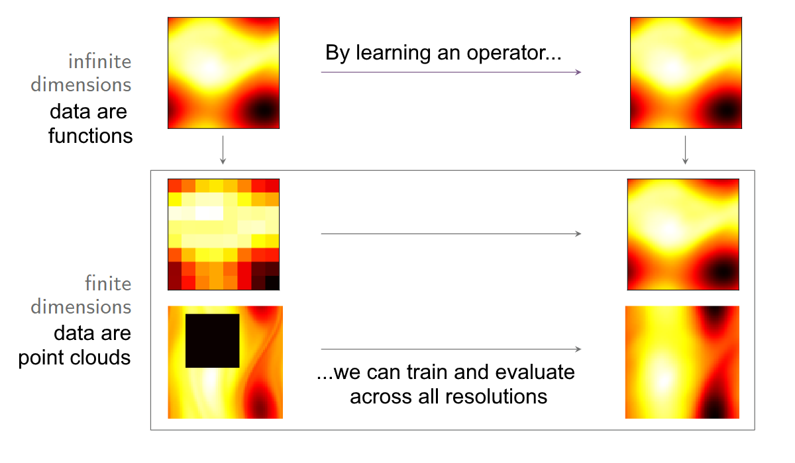

## Project

{fig-align="center" width="100%"}

Many machine-learning methods operate on discrete approximations of functions, such as pixellated images 
or sensor measurements. Most are "discretise-first": convolutional neural networks, for example, are 
designed from the outset for a fixed grid and cannot generalise across resolutions or geometries.
This limits applications in science, where data often lie on irregular meshes, and can cause 
degradation at high resolutions, such as aliasing and texture-sticking artifacts [[1]](#ref1).

Neural operators address this by directly learning maps between function spaces: 
a model is designed in function space and then discretised on the fly, enabling 
a single model to be trained and evaluated across all resolutions and geometries [[2]](#ref2).
Operator architectures cannot rely on standard building blocks like discrete convolutions, 
which require fixed grids; instead, they must use well-defined function-space operations, 
as in the widely adopted Fourier neural operator (FNO).

Designing efficient, resolution-invariant operator architectures remains a significant
challenge, and a performance gap persists between operator and fixed-resolution methods [[3]](#ref3). 
This project aims to bridge this gap by representing discretised functions as point clouds—arbitrary
lists of mesh points and function values—building on the rich literature on point-cloud machine learning.
Using functional analysis and measure theory, the project will identify point-cloud methods that extend
to valid neural operators and deploy them on scientific datasets, with potential applications in surrogate
modelling, dimension reduction, and generative tasks [[4]](#ref4).

### References
[1] T. Karras, M. Aittala, S. Laine, E. Härkönen, J. Hellsten, J. Lehtinen, and T. Aila. Alias-free generative adversarial networks.<a href="https://arxiv.org/abs/2106.12423"> https://arxiv.org/abs/2106.12423 </a>

[2] N. B. Kovachki, S. Lanthaler, and A. M. Stuart. Operator learning: algorithms and analysis.<a href="https://www.sciencedirect.com/science/chapter/handbook/abs/pii/S1570865924000097"> https://www.sciencedirect.com/science/chapter/handbook/abs/pii/S1570865924000097</a>

[3] P. Hagemann, S. Mildenberger, L. Ruthotto, G. Steidl, N. T. Yang. Multilevel diffusion: infinite dimensional score-based diffusion models for image generation. <a href="https://epubs.siam.org/doi/10.1137/23M1614092">https://epubs.siam.org/doi/10.1137/23M1614092</a>

[4] J. Bunker, M. Girolami, H. Lambley, A. M. Stuart, and T. J. Sullivan. Autoencoders in function space. <a href="https://jmlr.org/papers/volume26/25-0035/25-0035.pdf">https://jmlr.org/papers/volume26/25-0035/25-0035.pdf</a>
