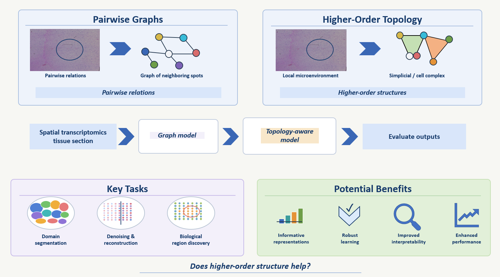

## Lucia Testa

Lucia Testa is a Postdoctoral Researcher at University Medical Center Hamburg-Eppendorf (UKE), Germany. 
She earned both her Master’s degree and PhD in Data Science from Sapienza University of Rome, where she completed her PhD in 2025 under the supervision of Prof. Sergio Barbarossa. 
Her doctoral research introduced new approaches to topological signal processing and learning over uncertain domains.

Her current interests focus on Topological Deep Learning and its applications to Computational Biology and Computational Chemistry. 
In 2021, she was awarded the Best Master’s Thesis Award by Fondazione Sapienza.

## Project

{fig-align="center" width="100%"}

Spatial transcriptomics (ST) measures gene expression while preserving spatial context, enabling the study of tissue architecture and local cellular neighborhoods in situ [[1]](#ref1). 
Many existing computational pipelines for ST rely on graph-based models, which have been very successful for tasks such as spatial domain identification and representation learning, but are naturally limited to pairwise relations between spots or cells [[2](#ref2),[3](#ref3)]. 
This project explores whether topological deep learning can provide a richer framework for ST by explicitly modeling higher-order spatial interactions, such as small multi-spot microenvironments, through simplicial or cell complexes [[4](#ref4),[5](#ref5)].

We will represent a tissue section both as a graph and as a higher-order topological object built from spatial adjacency, then compare standard graph baselines with topology-aware models that propagate information over nodes, edges, and higher-order structures [[2](#ref2),[4](#ref4)]. 
The technical goal is to test whether such topological representations can improve tasks such as spatial domain segmentation, denoising or reconstruction, and the identification of biologically meaningful tissue regions [[2](#ref2),[3](#ref3),[6](#ref6)]. 
More broadly, the project will investigate whether higher-order spatial interactions can serve as a useful inductive bias for learning informative representations of tissue architecture while improving downstream tasks.

### References
[1] Rao, A., Barkley, D., França, G. S., & Yanai, I. *Exploring tissue architecture using spatial transcriptomics*. Nature, 596, 211–220 (2021).

[2] Dong, K., & Zhang, S. *Deciphering spatial domains from spatially resolved transcriptomics with an adaptive graph attention auto-encoder*. Nature Communications, 13, 1–12 (2022).

[3] Long, Y. et al. *Spatially informed clustering, integration, and deconvolution of spatial transcriptomics with GraphST*. Nature Communications, 14, 1155 (2023).

[4] Papillon, M., Sanborn, S., Hajij, M., & Miolane, N. *Architectures of Topological Deep Learning: A Survey of Message-Passing Topological Neural Networks* (2023).

[5] Papamarkou, T. et al. *Topological Deep Learning is the New Frontier for Relational Learning*. Proceedings of the 41st International Conference on Machine Learning (ICML, 2024).

[6] Song, T. et al. *GNTD: reconstructing spatial transcriptomes with graph-guided neural tensor decomposition*. Nature Communications, 14, 7920 (2023).