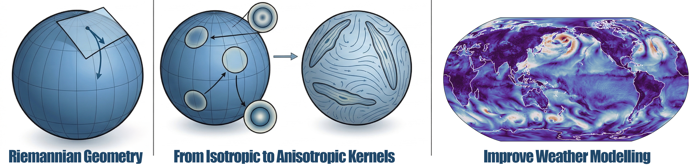

## Massimiliano Esposito

Max is a research scientist at IBM. 
He holds a PhD from Imperial College, with a thesis in harmonic analysis on the non-linear quantisation of pseudo-differential operators. 
His research at IBM focuses on AI for science, with a particular emphasis on AI for quantum computing, AI for nuclear fusion, and AI for materials discovery. 
In his spare time, he enjoys football, swimming, and considering how AI can improve maths discoveries and thinking.

## Simone Foti

Simone Foti is a Postdoctoral Researcher at Imperial College London, having completed a PhD at University College London and held 
research internships at Disney Research Studios and Adobe Research. His research lies at the intersection of geometric deep learning, 
computer graphics, and computer vision. Through his work, he solves problems in non-Euclidean domains, such as Riemannian surfaces 
and general geometries represented as meshes. Simone's primary focus is building machine learning models that respect the geometry of 
the space in which they operate, with applications ranging from AR/VR and movie production to plastic surgery and AI for Earth Science.

## Project

{fig-align="center" width="100%"}

Data-driven global weather prediction is now matching traditional physics-based models [[1]](#ref1), but modeling planetary dynamics 
natively on the sphere presents fundamental geometric hurdles. While Spherical CNNs [[2]](#ref2) and Neural Operators [[3]](#ref3) successfully 
avoid the polar distortions of 2D grids, they typically rely on isotropic (circular) filters or strict rotational equivariance. 
Consequently, they struggle to efficiently capture elongated, highly directional atmospheric structures. We hypothesize that 
dynamically learning the directionality of fluid flows is crucial for the next generation of meteorologically accurate neural models.

To address this, we will develop **AnisoSphere**, a geometric deep learning framework introducing anisotropic geodesic convolutions. 
We will construct dynamic receptive fields that stretch and orient themselves according to local fluid dynamics. While recent 
advancements have dramatically accelerated general mesh-based geodesic solvers [[4]](#ref4), we can achieve the ultimate computational 
throughput required for planetary-scale data by designing novel, analytically exact geometric operators tailored specifically 
to the continuous spherical manifold. This ensures precise, direction-aware convolutions while completely bypassing the need for 
iterative geodesic tracing.

During the summer school, mentees will work at the intersection of differential geometry and climate science. They will learn 
the foundational principles of Riemannian geometry on the sphere, translating these concepts into custom, differentiable PyTorch 
layers to build the AnisoSphere operator. Mentees will then systematically evaluate the architecture on the ERA5 reanalysis dataset, 
conducting rigorous ablation studies to benchmark the expressivity and sample efficiency of our anisotropic filters against 
standard 2D CNNs, isotropic spherical convolutions, and Graph Neural Networks.

### References
[1] Kochkov et al. "Neural general circulation models for weather and climate." Nature (2025).

[2] Cohen, Geiger, Koehler, Welling. "Spherical CNNs." ICLR (2018).

[3] Bonev et al. "Fourcastnet 3: A geometric approach to probabilistic machine-learning weather forecasting at scale." arXiv (2025).

[4]  Verninas, Korkmaz, Zafeiriou, Birdal, Foti. Parallelised Differentiable Straightest Geodesics for 3D Meshes. CVPR 2026. <a href="https://circle-group.github.io/research/DSG/">https://circle-group.github.io/research/DSG/</a>
