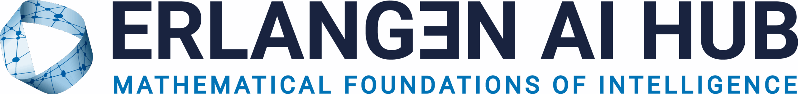
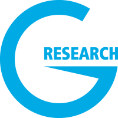
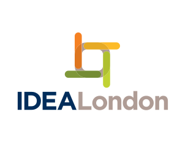
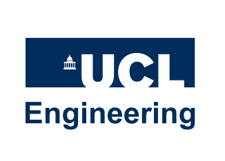
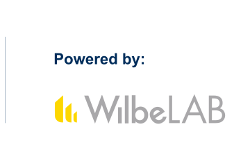

## Sponsors

We gratefully acknowledge funding from 
the Heilbronn Institute for Mathematical Research and the UKRI/EPSRC Additional Funding Programme for Mathematical Sciences,
Imperial College London, the Erlangen AI Hub, LSGNT, Huawei, and G-research.

## Call for Sponsors

We are excited to announce sponsorship opportunities for our event. 
You can preview our sponsorship tiers below, or download the complete brochure [here](files/sponsorship_brochure.pdf).

If you are interested in sponsoring, please contact us at [logml.committee@gmail.com](mailto:logml.committee@gmail.com).

